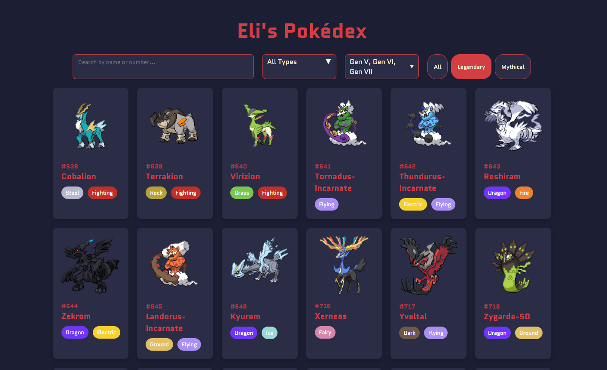
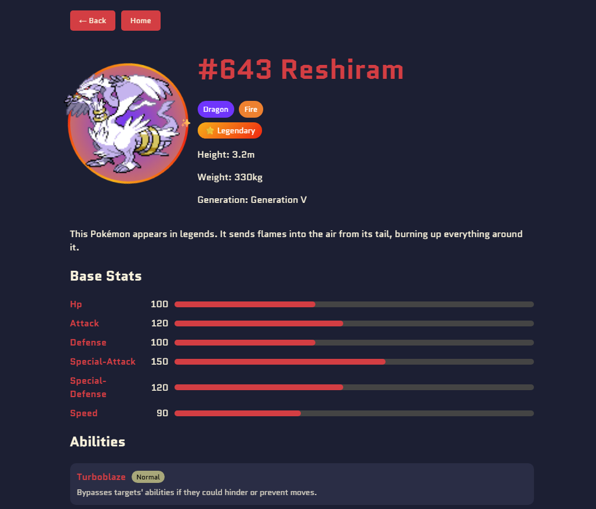

# Pokedex

A full stack Pokédex web app built with React and Node.js, powered by the [PokéAPI](https://pokeapi.co). Browse, search, and filter Pokémon across all generations with a clean, colorful UI.

🔗 **Live Demo:** [pokedex-tawny-phi.vercel.app](https://pokedex-tawny-phi.vercel.app)

---

## ✨ Features

- **Browse all Pokémon** across Generations I–VIII
- **Search** by name or Pokédex number in real time
- **Filter by type** — all 18 types with color-coded pill badges
- **Filter by generation** — multi-select dropdown (mix and match gens)
- **Filter by rarity** — quickly find Legendary and Mythical Pokémon
- **Pokémon detail page** with:
  - Type-colored radial gradient behind the sprite
  - Rotating ring effect for Legendary (gold) and Mythical (purple) Pokémon
  - Base stats with animated progress bars
  - Abilities with hidden/normal label and description
  - Level-up moves only (no TMs)
  - Evolution chain with clickable cards
  - Pokémon description and generation label
  - 1 in 10 chance of a shiny sprite on each visit 🎲
- **State persistence** — search, type, rarity and gen filters are saved when navigating back
- **Scroll position restore** — returns to exactly where you were in the grid
- **Frontend caching** via React Context — cards load instantly after first visit
- **Backend caching** via node-cache — API responses cached for 1 hour

---

## 🛠️ Tech Stack

**Frontend**


**Backend**


**Deployment**


---

## 🚀 Getting Started

### Prerequisites
- [Node.js](https://nodejs.org) v16+
- npm

### Installation

**1. Clone the repo**
```bash
git clone https://github.com/eli-wynn/Pokedex.git
cd Pokedex
```

**2. Set up the backend**
```bash
cd server
npm install
node server.js
```
Server runs on `http://localhost:5000`

**3. Set up the frontend**

Open a new terminal:
```bash
cd client
npm install
```

Create a `.env` file in the `client` folder:
```
REACT_APP_API_URL=http://localhost:5000
```

Then start the app:
```bash
npm start
```

App runs on `http://localhost:3000`

---

## 📡 API Documentation

All endpoints are prefixed with `/api`.

### `GET /api/pokemon`
Returns a list of Pokémon.

| Query Param | Type | Default | Description |
|-------------|------|---------|-------------|
| `offset` | number | `0` | Starting index |
| `limit` | number | `905` | Number of Pokémon to return |

**Example:**
```
GET /api/pokemon?offset=0&limit=151
```

---

### `GET /api/pokemon/:id`
Returns full details for a single Pokémon by ID or name.

**Example:**
```
GET /api/pokemon/pikachu
GET /api/pokemon/25
```

**Response:**
```json
{
  "id": 25,
  "name": "pikachu",
  "description": "When several of these Pokémon gather...",
  "sprite": "https://...",
  "sprite_shiny": "https://...",
  "types": ["electric"],
  "abilities": [{ "ability": "static", "hidden": false }],
  "stats": [{ "name": "hp", "value": 35 }],
  "moves": ["thunder-shock", "tail-whip"],
  "height": 0.4,
  "weight": 6.0,
  "generation": "Generation I",
  "isLegendary": false,
  "isMythical": false,
  "evolutionChain": [
    { "name": "pichu", "id": "172" },
    { "name": "pikachu", "id": "25" },
    { "name": "raichu", "id": "26" }
  ]
}
```

---

### `GET /api/ability/:name`
Returns the name and description of a Pokémon ability.

**Example:**
```
GET /api/ability/static
```

**Response:**
```json
{
  "name": "static",
  "description": "The Pokémon is charged with static electricity..."
}
```

---

### `GET /api/types`
Returns all 18 Pokémon types (excludes `stellar` and `unknown`).

**Example:**
```
GET /api/types
```

---

## 🔮 Future Improvements

- [ ] Pokémon comparison tool — compare stats side by side
- [ ] Favourite/save Pokémon with persistent storage
- [ ] Type effectiveness chart on the detail page
- [ ] Animated sprite support
- [ ] Expand to Generation IX
- [ ] Loading skeleton cards instead of plain loading text
- [ ] Mobile responsiveness improvements
- [ ] Dark/light theme toggle

---

## 📸 Screenshots

> Add screenshots of your app here by dragging images into the GitHub editor!

| Home Page | Detail Page |
|-----------|-------------|
|  |  |

---

## 👤 Author

**Eli Wynn**

[](https://eliwynn.ca)
[](https://www.linkedin.com/in/eliwynn/)
[](https://github.com/eli-wynn)